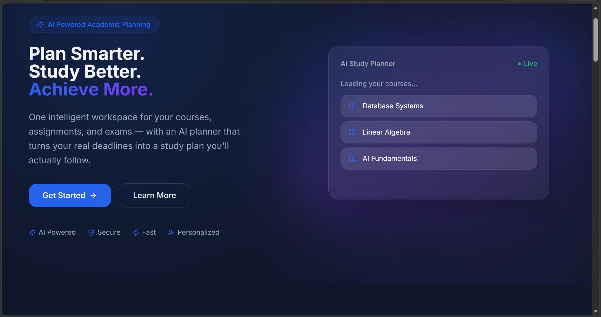
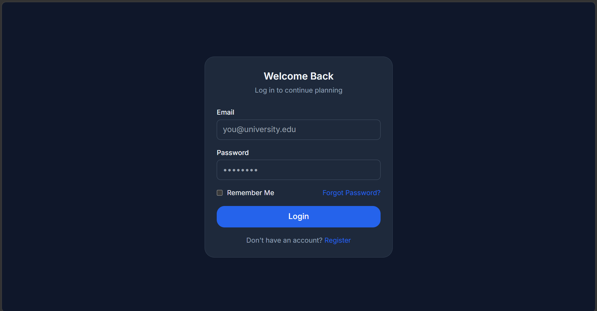
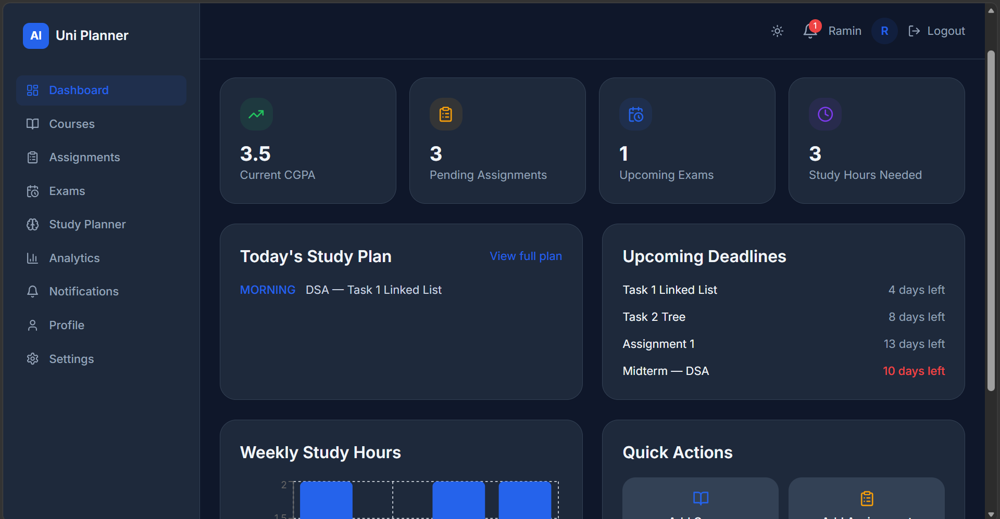
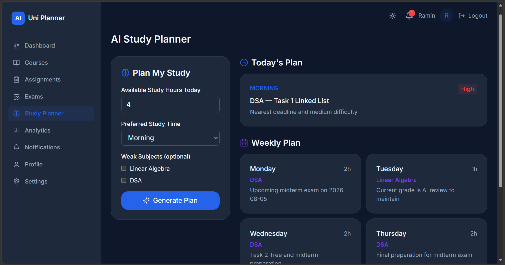
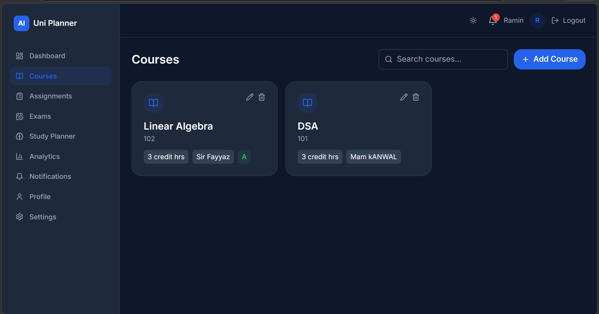
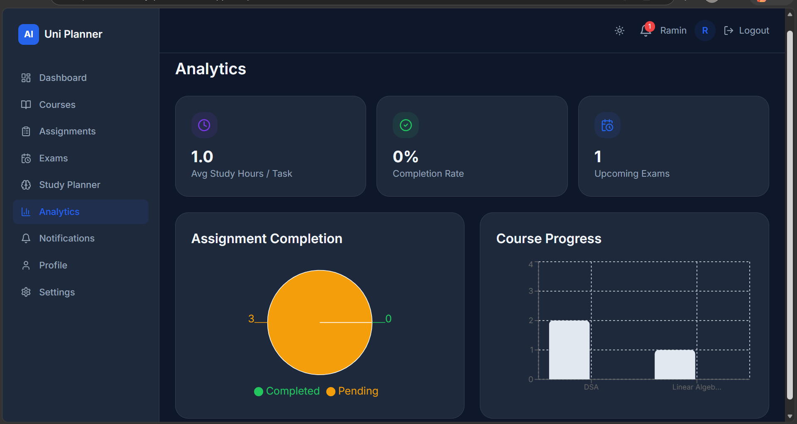

<div align="center">

<!-- 🖼️ BANNER PLACEHOLDER — replace this line with your banner image once ready -->
<!-- Example:  -->


<br /><br />

# 📘 AI University Planner

**Plan Smarter. Study Better. Achieve More.**

An intelligent academic planning platform that helps university students manage courses, assignments, and exams — and generates a personalized AI study plan from their real academic data.

<br />

[](https://nextjs.org/)
[](https://react.dev/)
[](https://www.typescriptlang.org/)
[](https://www.prisma.io/)
[](https://supabase.com/)
[](https://groq.com/)
[](https://vercel.com/)

<br />

**[🚀 View Live Demo](https://ai-university-planner.vercel.app)** &nbsp;·&nbsp; **[📂 GitHub Repository](https://github.com/RaminSajjad/ai-university-planner)**

</div>

---

## 📑 Table of Contents

- [Project Highlights](#-project-highlights)
- [Introduction](#-introduction)
- [Problem Statement](#-problem-statement)
- [Solution](#-solution)
- [Live Demo](#-live-demo)
- [Features](#-features)
- [AI Feature](#-ai-feature)
- [System Prompt (Summary)](#-system-prompt-summary)
- [Technologies Used](#-technologies-used)
- [Project Architecture](#-project-architecture)
- [Folder Structure](#-folder-structure)
- [Screenshots](#-screenshots)
- [Installation Guide](#-installation-guide)
- [Environment Variables](#-environment-variables)
- [Running the Project](#-running-the-project)
- [Future Improvements](#-future-improvements)
- [Challenges Faced](#-challenges-faced)
- [Lessons Learned](#-lessons-learned)
- [Conclusion](#-conclusion)
- [Author](#-author)

---

## ⭐ Project Highlights

- 🧠 **Real AI reasoning, not a gimmick** — the AI Study Planner only ever plans from data the student actually entered, and explains its reasoning for every recommendation
- 🔐 **Production-grade authentication** — bcrypt-hashed passwords, JWT sessions via NextAuth, fully protected routes
- 🗄️ **Real relational database** — PostgreSQL with a properly normalized Prisma schema (6 related models, cascading deletes, per-user scoping)
- 📊 **End-to-end feature set** — courses, assignments, exams, analytics, and notifications are all fully functional CRUD systems, not mockups
- 🎨 **Polished, responsive UI** — dark/light mode, mobile drawer navigation, loading skeletons, and custom error pages
- 🚀 **Actually deployed** — live and publicly accessible on Vercel, not just running locally

---

## 📖 Introduction

AI University Planner is a full-stack web application built with Next.js 15, PostgreSQL, and a large language model (via Groq) to help students organize their academic life in one place. Instead of juggling separate apps for course tracking, deadline reminders, and study scheduling, students manage everything — courses, assignments, exams, and an AI-generated study plan — from a single authenticated dashboard.

The project was built as a final-year academic project to demonstrate the practical application of AI in a real, everyday student workflow: turning scattered deadlines into an actionable, prioritized study plan.

---

## ❗ Problem Statement

University students typically manage their academic responsibilities across multiple disconnected tools — a notes app for courses, a calendar for exams, a to-do list for assignments, and, most often, memory for prioritizing what to study first.

**Who faces this problem:** Undergraduate and graduate students juggling multiple courses per semester, each with independent deadlines, exam dates, and varying difficulty.

**Why it matters:** Without a unified system, students commonly miss deadlines, underprepare for exams that arrive close together, or spend study time on the wrong subject at the wrong time. The cognitive overhead of manually prioritizing several competing deadlines is itself a source of academic stress.

---

## ✅ Solution

AI University Planner centralizes a student's courses, assignments, and exams in one database-backed system, and then uses an AI model to reason over that real data and produce a prioritized, time-bound study plan.

AI is useful here specifically because study planning is not a static task — the right plan depends on how many hours a student has today, which deadlines are closest, which subjects they're weak in, and which courses have exams coming up. Encoding that reasoning as a fixed algorithm would either oversimplify it or require constant manual rules; a language model, given the same structured rules and the student's real data, can weigh these factors together and explain its reasoning in natural language for each recommendation.

Critically, the AI is constrained to only work with data the student has actually entered — it is explicitly instructed never to invent assignments, exams, or courses.

---

## 🌐 Live Demo

<div align="center">

### 👉 [**Launch AI University Planner**](https://ai-university-planner.vercel.app) 👈

*No installation needed — register a free account and try the AI Study Planner in minutes.*

</div>

---

## ✨ Features

All features listed below are implemented and functional in the current codebase.

### 🔐 Authentication
- Email/password registration with bcrypt password hashing
- Credentials-based login via NextAuth.js (JWT session strategy)
- Protected routes — every core page redirects unauthenticated users to `/login`
- Logout
- Password change from Settings (verifies current password before updating)

### 📚 Course Management
- Add, edit, and delete courses
- Fields: course name, course code, credit hours, instructor, semester, current grade
- Search courses by name, code, or instructor

### 📝 Assignment Management
- Add, edit, and delete assignments, linked to a course
- Fields: title, description, deadline, difficulty (Easy/Medium/Hard), estimated study hours, notes
- Mark assignments complete/incomplete with one click
- Search by title/course and filter by status (All / Pending / Completed)
- Live "days remaining" countdown per assignment

### 🗓️ Exam Management
- Add, edit, and delete exams, linked to a course
- Fields: exam type, date, time, location, notes
- Live countdown per exam (e.g. "3 days left", "Overdue")

### 🧠 AI Study Planner
- Form inputs: available study hours today, preferred study time, optional weak subjects (selected from the student's own courses)
- Generates a **Today's Plan**, a **Weekly Plan**, and general **Study Tips**
- Each recommendation includes a stated reason and a priority level (High/Medium/Low)
- Generated plans are persisted to the database and the most recent plan is shown on return visits

### 📊 Dashboard
- Current CGPA (from Profile), pending assignment count, upcoming exam count, total remaining study hours
- Preview of today's AI study plan
- Upcoming deadlines (assignments and exams combined)
- Weekly study-hours bar chart (Recharts) sourced from the latest AI plan
- Quick-action shortcuts to Courses, Assignments, Exams, and the Planner

### 📈 Analytics
- Assignment completion pie chart (completed vs. pending)
- Course progress bar chart (completed vs. total assignments per course)
- Average study hours per task and overall completion rate

### 🔔 Notifications
- Automatically generated (not user-created) for:
  - An assignment due within 2 days
  - An exam within 1 day
  - An assignment marked complete
  - A new AI study plan generated
- Duplicate-safe generation (checked against existing notification titles before creating new ones)
- Unread count badge in the navbar
- Mark individual notifications or all notifications as read

### 👤 Profile
- Edit name, university, department, semester, CGPA, and target CGPA

### 🎨 UI / UX
- Fully responsive layout with a collapsible sidebar and a mobile drawer menu
- Dark mode / light mode toggle (persisted via `next-themes`)
- Loading skeletons for Dashboard, Courses, Assignments, Exams, and Analytics
- Custom 404 and error pages
- Toast notifications for all create/update/delete actions (via Sonner)

---

## 🤖 AI Feature

### What AI model is used?
**Llama 3.3 70B**, served through the **Groq API** (OpenAI-compatible chat completions endpoint).

### Why was it chosen?
Groq was selected for two practical reasons: it offers a genuinely free tier suitable for a student project with no ongoing cost, and its inference is extremely fast compared to typical cloud LLM providers, which keeps the study-plan generation responsive inside the UI. Llama 3.3 70B is capable enough to follow structured, multi-constraint instructions (prioritization rules) and reliably return valid JSON.

### What inputs does it receive?
For each generation request, the model receives:
- Today's date
- The student's stated available study hours and preferred study time
- Any courses the student marked as weak subjects
- The student's actual courses (name, code, current grade)
- The student's pending (non-completed) assignments (title, course, deadline, difficulty, estimated hours)
- The student's upcoming exams (course, type, date)

All of this data is queried live from the PostgreSQL database for the logged-in user immediately before the request is sent — nothing is hardcoded or cached from a previous session.

### What output does it generate?
A structured JSON object containing:
- `todayPlan` — an array of time-blocked recommendations, each with a course, task, reason, and priority
- `weeklyPlan` — a day-by-day breakdown with a focus area, allocated hours, and reason
- `tips` — general study advice for the week

### How does it improve the user experience?
Instead of a student manually deciding what to study and when — a decision that requires mentally weighing several deadlines, difficulty levels, and available time — the planner produces that decision automatically, in seconds, along with an explanation for each item so the student can trust (and if needed, override) the reasoning.

---

## 🧭 System Prompt (Summary)

The AI is not given a fully open-ended prompt. It operates under a fixed instruction set that governs every generation:

- Prioritize the nearest deadlines first.
- Prioritize difficult courses and any subjects the student explicitly marked as weak.
- Never schedule more study time than the hours the student said they have available.
- Give extra weight to courses with upcoming exams.
- **Never invent assignments, exams, or courses** — only reason over the data explicitly provided in that request.
- Provide a short, human-readable reason for every recommendation.
- Respond with strictly valid JSON matching a predefined schema — no explanatory text outside the JSON.

The application enforces this contract further on the backend: the AI's response is parsed and validated against a Zod schema before it is ever saved or shown to the user. If the response doesn't match the expected structure, the request fails safely with an error rather than displaying malformed data.

---

## 🛠️ Technologies Used

| Category | Technologies |
|---|---|
| **Frontend** | Next.js 15 (App Router) · React 19 · TypeScript · Tailwind CSS · Framer Motion · Lucide React · Recharts · Sonner · next-themes |
| **Backend** | Next.js Server Actions · Next.js Route Handlers (`/api/auth/[...nextauth]`) |
| **Database** | PostgreSQL (Supabase) · Prisma ORM |
| **Authentication** | NextAuth.js (Credentials Provider, JWT sessions) · Prisma Adapter · bcryptjs |
| **AI** | Groq API — Llama 3.3 70B |
| **Validation** | Zod (forms + AI-response schema validation) |
| **Styling** | Tailwind CSS with a custom design token system · `tailwindcss-animate` |
| **Deployment** | Vercel (application) · Supabase (managed PostgreSQL) |

---

## 🏗️ Project Architecture

```
                         ┌────────────────────┐
                         │       Browser        │
                         │  (Next.js Client)     │
                         └──────────┬──────────┘
                                    │
                                    ▼
                    ┌───────────────────────────────┐
                    │        Next.js App Router      │
                    │   (Pages, Layouts, Middleware)  │
                    └───────────────┬─────────────────┘
                                    │
              ┌─────────────────────┼─────────────────────┐
              ▼                     ▼                     ▼
   ┌──────────────────┐  ┌──────────────────┐  ┌───────────────────┐
   │   NextAuth.js      │  │  Server Actions    │  │  Route Handlers     │
   │  (authentication)  │  │ (CRUD + AI calls)  │  │ (/api/auth/*)       │
   └─────────┬──────────┘  └─────────┬──────────┘  └──────────┬─────────┘
             │                        │                         │
             └────────────┬───────────┴─────────────────────────┘
                           ▼
                 ┌───────────────────┐
                 │    Prisma ORM       │
                 └─────────┬─────────┘
                           ▼
                 ┌───────────────────┐
                 │  PostgreSQL          │
                 │  (Supabase)           │
                 └───────────────────┘

        Server Actions also call out to:
                           │
                           ▼
                 ┌───────────────────┐
                 │   Groq API            │
                 │ (Llama 3.3 70B)       │
                 └───────────────────┘
```

---

## 📁 Folder Structure

```
ai-university-planner/
├── app/
│   ├── (auth)/
│   │   ├── login/page.tsx
│   │   └── register/page.tsx
│   ├── api/auth/[...nextauth]/route.ts
│   ├── analytics/            page.tsx, loading.tsx
│   ├── assignments/          page.tsx, loading.tsx
│   ├── courses/               page.tsx, loading.tsx
│   ├── dashboard/             page.tsx, loading.tsx
│   ├── exams/                  page.tsx, loading.tsx
│   ├── notifications/         page.tsx
│   ├── planner/                page.tsx
│   ├── profile/                page.tsx
│   ├── settings/               page.tsx
│   ├── error.tsx
│   ├── not-found.tsx
│   ├── globals.css
│   ├── layout.tsx
│   └── page.tsx               (landing page)
├── actions/                    # Server Actions (backend logic)
│   ├── assignments.ts
│   ├── auth.ts
│   ├── courses.ts
│   ├── dashboard.ts
│   ├── exams.ts
│   ├── notifications.ts
│   ├── planner.ts
│   └── profile.ts
├── components/
│   ├── analytics/
│   ├── assignments/
│   ├── auth/
│   ├── courses/
│   ├── dashboard/
│   ├── exams/
│   ├── landing/
│   ├── layout/
│   ├── notifications/
│   ├── planner/
│   ├── profile/
│   ├── settings/
│   └── ui/
├── lib/
│   ├── ai.ts                   # Groq integration + AI system prompt
│   ├── auth.ts                 # NextAuth configuration
│   ├── prisma.ts                # Prisma client singleton
│   ├── utils.ts                 # Formatting helpers
│   └── validations.ts           # Zod schemas
├── prisma/
│   └── schema.prisma
├── types/
│   ├── index.ts
│   └── next-auth.d.ts
├── .env.example
├── package.json
├── tailwind.config.ts
└── tsconfig.json
```

---

## 📸 Screenshots

<table>
<tr>
<td width="50%" align="center">

**🏠 Landing Page**



</td>
<td width="50%" align="center">

**🔐 Login**



</td>
</tr>
<tr>
<td width="50%" align="center">

**📊 Dashboard**



</td>
<td width="50%" align="center">

**🧠 AI Study Planner**



</td>
</tr>
<tr>
<td width="50%" align="center">

**📚 Courses**



</td>
<td width="50%" align="center">

**📈 Analytics**



</td>
</tr>
</table>

---

## ⚙️ Installation Guide

```bash
# 1. Clone the repository
git clone https://github.com/RaminSajjad/ai-university-planner.git
cd ai-university-planner

# 2. Install dependencies
npm install

# 3. Set up environment variables (see below)
cp .env.example .env

# 4. Push the Prisma schema to your database
npx prisma db push

# 5. Run the development server
npm run dev
```

---

## 🔑 Environment Variables

The following variables are required. No values are included here — see `.env.example` for the expected format.

| Variable | Purpose |
|---|---|
| `DATABASE_URL` | PostgreSQL connection string (pooled), used by Prisma at runtime |
| `DIRECT_URL` | PostgreSQL direct connection string, used by Prisma for migrations |
| `NEXTAUTH_URL` | The base URL of the deployed application, required by NextAuth |
| `NEXTAUTH_SECRET` | Secret used by NextAuth to sign session tokens |
| `GROQ_API_KEY` | API key for the Groq API, used by the AI Study Planner |

---

## ▶️ Running the Project

1. Ensure PostgreSQL (via Supabase) is provisioned and `DATABASE_URL` / `DIRECT_URL` are set.
2. Run `npx prisma db push` to sync the schema.
3. Run `npm run dev` and open `http://localhost:3000`.
4. Register a new account at `/register`, then log in at `/login`.
5. Add at least one course under `/courses` — this is required before assignments, exams, or an AI study plan can be created.
6. Add assignments and/or exams against that course.
7. Visit `/planner`, set available hours and preferred time, and generate a plan.

---

## 🚀 Future Improvements

- AI chatbot for academic queries, backed by the same course/assignment data
- PDF syllabus import to auto-populate assignments and exam dates
- OCR for scanned assignment sheets
- Google Calendar sync for exams and deadlines
- Email delivery for notifications (currently in-app only)
- Configurable notification preferences (currently automatic and non-configurable)
- Collaborative/team study groups

---

## 🧩 Challenges Faced

- **Serverless database connections:** Supabase's direct PostgreSQL connection uses IPv6, which is unreachable from some networks and from serverless functions without an add-on. This required switching both `DATABASE_URL` and `DIRECT_URL` to Supabase's connection pooler (PgBouncer) endpoints, which support IPv4.
- **React 19 / Next.js version alignment:** Adopting the `useActionState` hook for form handling required upgrading from React 18 to React 19, which in turn required aligning the Next.js version and adding a `.npmrc` with `legacy-peer-deps=true` to resolve peer-dependency conflicts during deployment on Vercel.
- **Constraining AI output:** Early iterations of the AI prompt risked producing free-form text instead of structured data. This was solved by combining an explicit JSON-only instruction in the system prompt with Groq's `response_format: json_object` mode and a Zod schema validation step before the response is trusted or stored.
- **Preventing hallucinated study plans:** Because the AI could plausibly generate a "reasonable-sounding" plan even without real data, the system prompt explicitly forbids inventing assignments, exams, or courses, and the application only ever sends the AI data that was queried directly from the database for that request.

---

## 📚 Lessons Learned

Building this project reinforced that AI features are most reliable when treated as one constrained component in a larger, deterministic system rather than as the entire application logic — the database, validation layer, and prompt constraints do as much work toward correctness as the model itself. It also highlighted practical, often-overlooked realities of shipping a full-stack app: connection pooling behavior differs meaningfully between local development and serverless deployment, and dependency version alignment (React, Next.js, and peer dependencies) can be as significant an engineering task as feature development.

---

## 🎯 Conclusion

AI University Planner demonstrates a complete, end-to-end application of AI to a genuine student workflow: real authenticated data in, a constrained and validated AI reasoning step, and an actionable study plan out. Beyond the AI feature itself, the project delivers a fully functional academic management system — authentication, course/assignment/exam CRUD, analytics, and notifications — built on a production-appropriate stack (Next.js, PostgreSQL, Prisma) and deployed live on Vercel.

---

## 👤 Author

<div align="center">

### **Ramin Sajjad**
BS Artificial Intelligence Student  
National Textile University (NTU), Faisalabad

This project was developed as the capstone project for the **AI Skill Bridge Program**, conducted under the **Higher Education Commission (HEC)**, **National Vocational & Technical Training Commission (NAVTTC)**, and the **Prime Minister's Youth Programme (PMYP)**.

[](https://github.com/RaminSajjad/ai-university-planner)
[](https://ai-university-planner.vercel.app)

</div>
